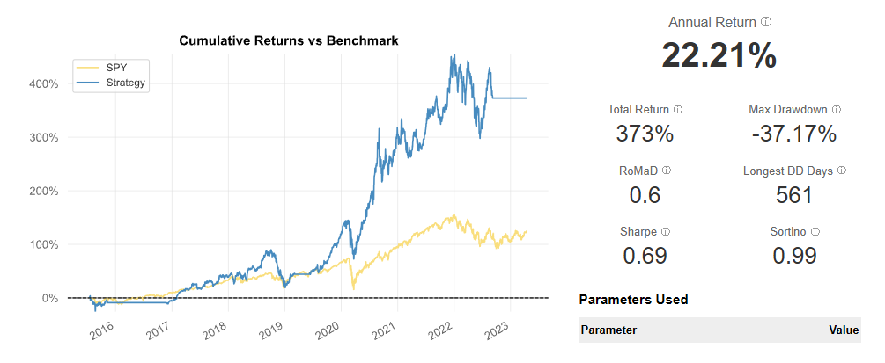

# Disclaimer
**This trading bot was developed for research purposes only. It is not intended to be used as a tool for trading or making financial decisions**

# MACD Strategy Trading Bot

This trading bot was built using the [Lumibot](https://lumibot.lumiwealth.com/) framework and the Alpaca API. The bot uses a trading strategy based on the Moving Average Convergence Divergence (MACD) indicator to generate and execute buy and sell signals for different stocks.

## Features

-   **MACD-Based Strategy**: The bot uses the MACD indicator along with other methods to identify buy and sell opportunities.
-   **Automated Trading**: Trades can be automatically executed using Alpaca as the broker.
-   **Backtesting**: The bot can be backtested on historical data using Yahoo Finance data.

## Requirements

-   Python 3.8 or higher
-   Pip
-   Alpaca API Account (with API key and secret)

## Setup

1.  **Clone the repository**:
    
```sh
git clone https://github.com/ErikTsai/MACD-trading-bot.git` 
```

2.  **Install the required Python packages in your project's virtual environment**:
    
    
```sh
pip install lumibot pandas numpy python-dotenv
```
3.  **Create a free [Alpaca](https://alpaca.markets/) account and get your API keys**
    
4.  **Set up your environment variables**:
    
    Create a `.env` file in the root directory and add your Alpaca API credentials:
```sh
API_KEY = your_alpaca_api_key
API_SECRET = your_alpaca_secret_key
```
    

    

## Usage

### Choosing a Symbol to Trade
To choose which stock to trade, set the `self.symbol` variable to a symbol of your choice.
```sh
self.symbol = "SYMBOL" #AAPL OR SPY AS AN EXAMPlE
```

### Running the Bot in Live Trading Mode

To run the bot in live trading mode, set the `trade` variable in the `__main__` block at the end of the code to `True`.
```sh
if __name__ == "__main__":
    trade = True
```
### Backtesting the Strategy

To backtest the strategy, set the `trade` variable to `False` and specify the backtesting period:

```sh
if __name__ == "__main__":
    trade = False
```
```sh
backtesting_start  =  datetime(2015, 4, 15) #(year, month, day)
backtesting_end  =  datetime(2023, 4, 15)
```
 

### Strategy Details

-   **MACD**: The MACD is calculated using a 12-day EMA, a 26-day EMA, and a 9-day signal line.
-   **200-day EMA**: The strategy uses a 200-day EMA to determine the overall market trend. Buy and sell signals are only generated when the market is in an uptrend and downtrend respectively. 
-   **Position Management**: The bot will buy the stock if no position is currently held when a buy signal is triggered. It will sell the entire position when a sell signal is triggered.


## Results
Here are some of the backtesting results from the trading bot (Trading from April 15, 2015 to April 15, 2023)

**Trading SPY:**


**Trading AAPL:**



**Trading GLD:**


**Trading WBA:**


## Thoughts

The MACD strategy used by the bot performs well when trading stocks that have clear trends. Stocks in strong uptrends or downtrends, such as SPY and AAPL, yielded high annual returns. Conversely, GLD, which experienced relatively sideways movement from 2018 to 2023, resulted in lower annual returns.

While WBA has been in a consistent downtrend, the backtesting results showed a negative return. This outcome stems from the current bot's handling of bearish signals—where it sells all positions instead of properly shorting the stock. I plan on implementing this functionality in the future, and using the lessons I've learned from this project to build a more effectiving trading bot.


## Contributing

Feel free to open issues or submit pull requests if you have any suggestions or improvements.

## License

This project is licensed under the MIT License.